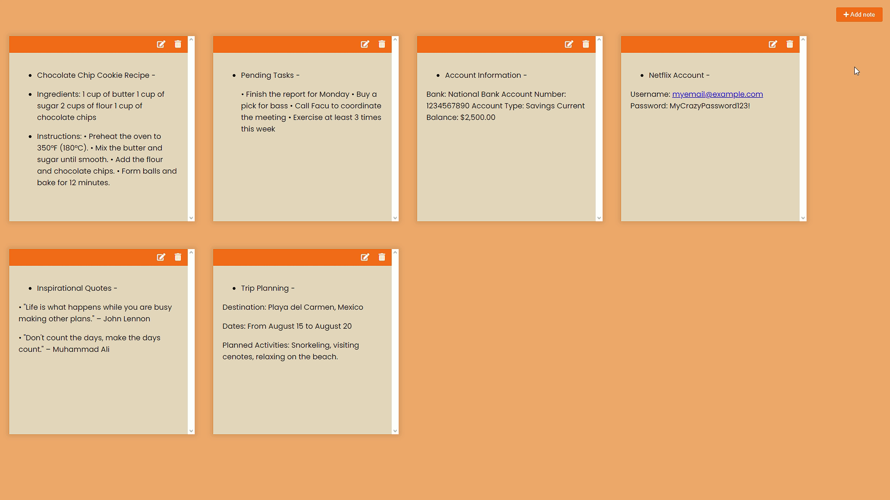

# Citrus Notes

## Try Demo [here](https://citrusnotes.netlify.app).
 
## Description

**Citrus Notes** is a simple and minimalist web application that allows users to create, edit, and delete notes. The application uses local storage to save notes, ensuring that they persist even after closing the browser!

## Features

- **Add Notes**: Easily create new notes.
- **Edit Notes**: Change the content of existing notes.
- **Delete Notes**: Remove notes that you no longer need.
- **Data Persistence**: Notes are saved in the browser's local storage.

## Technologies Used

- **HTML**: For the basic structure of the application.
- **CSS**: For design and visual presentation.
- **JavaScript**: For application logic and DOM manipulation.
- **Font Awesome**: For the icons used in the interface.

## Credits
Author: Facu14Carrizo

## License
This project is licensed under the MIT License.
